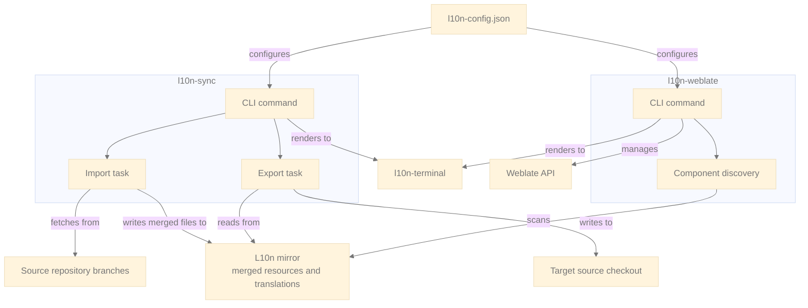
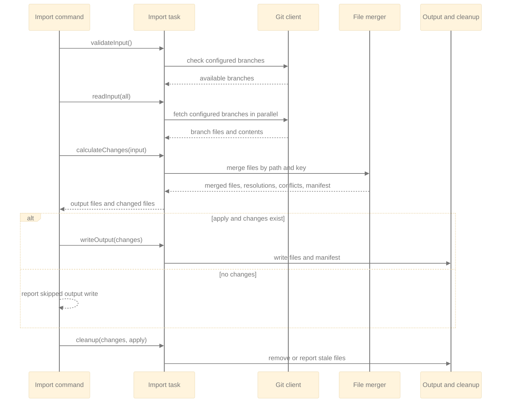
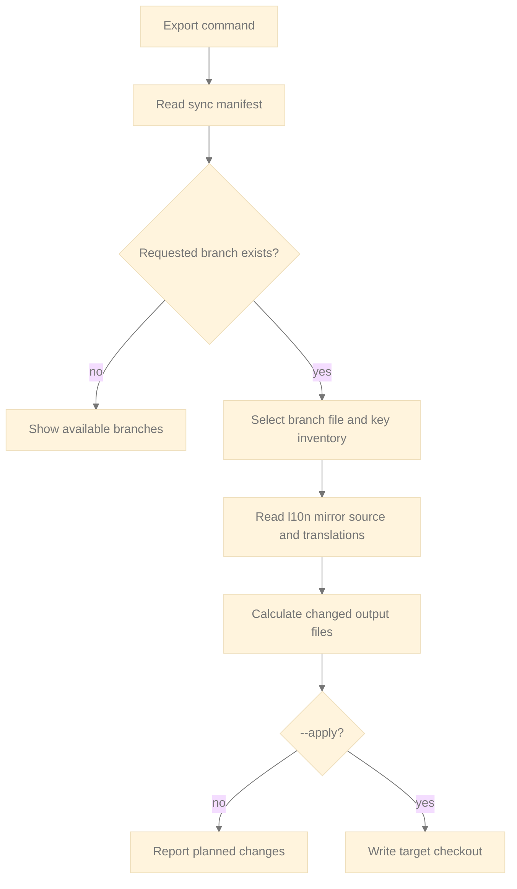

# Architecture overview

The tools have two independent command-line applications that share project configuration and terminal rendering.
Commands own presentation and delegate work to small task classes. Tasks own the operation flow and use I/O classes for
Git, files, the sync manifest, and Weblate HTTP calls.

## Import

Import creates one merged l10n mirror from the configured source branches. Resource keys are unioned by key ID: a key
that exists on only one branch is retained. When the same key has different content, the first configured branch wins
and the command reports every branch variant. Text files use the same first-branch selection and report a conflict when
their contents differ.

The import task exposes these operation boundaries:

1. `validateInput` verifies all configured branches before any import work continues.
2. `readInput` fetches and reads files.
3. `calculateChanges` merges internally and produces `ImportChanges` for reporting, writing, and cleanup.
4. `writeOutput` writes changed output files and the manifest only when there are changes.
5. `cleanup` removes stale mirror files only when their source no longer exists in every covered branch.

## Export

The l10n mirror is the local repository that holds the merged resources and translations managed through Weblate. It is
the import destination and the directory passed to export as `--l10n-repo`; it is distinct from both the tools checkout
and the target source checkout.

Export is driven by `l10n-sync-manifest.json`, produced by a prior applied import. The manifest records which source
keys belong to each branch. Export reads the mirror, selects that branch's keys from source and translation resource
files, and compares them with the target checkout before writing.

## Weblate management

The Weblate CLI discovers Android and Compose resource components under the l10n mirror, excluding configured ignored
modules. It compares the local component set with Weblate and can list, create, update, or delete components. Network
operations are dry runs by default; `--apply` authorizes the corresponding API mutation.
